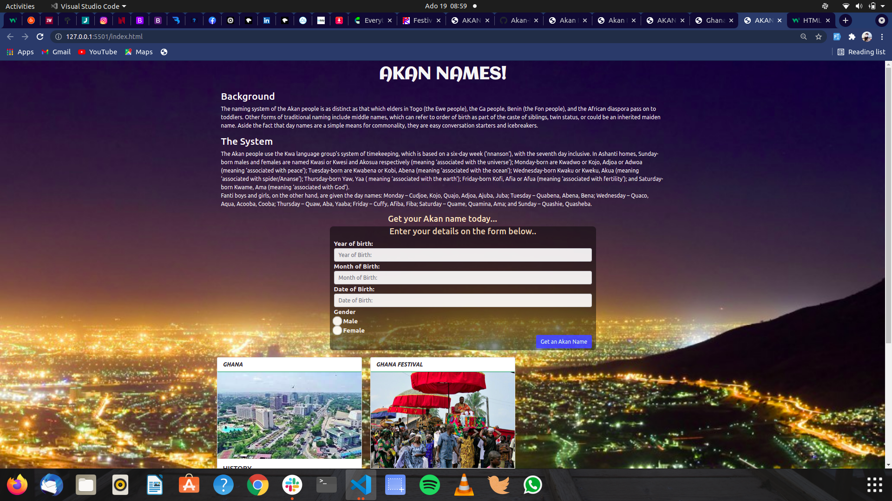

Akan-Names
Author
FREDRICK G. MWANGI

Description
This project is a web application that takes a user's birthday and calculates the day of the week they were born and then depending on their gender outputs their Akan Name.

Screenshot

Installation / Setup instruction
Open Terminal {Ctrl+Alt+T}

git clone https://github.com/FREDRICK-01/AKAN-NAMES.git

cd Akan-Names

code . or atom . based on the text editor you have.

Technologies Used
HTML5
CSS
JavaScript
markdown
Bootstrap
BDD
Enter century of birth eg 20 for 2019, Input Example 20 Output example 20

Enter year of Birth eg 19 for 2019 Input Example 19 Output Example 19

Enter month of birth eg 1 for january Input example 1 Output example 1

Enter Date of the month you were born in eg 20 input example 20 output example 20

Select gender Input example male output male

Submit. Input example, the program compares the inputs with the conditions set for the inputs eg if No input field is empty, the program executes else an alert to enter valid deatils.

0 < Date >= 31.
0 < Month >= 12
Gender Male or Female.

True value is output. Output example: You were born on Sunday and Your akan name is Kwasi! &nbsp If your gender is Male.
True value is output. Output example: You were born on Sunday and Your akan name is Akosua! &nbsp If your gender is female.
Example

century input -- 20
year input -- 20
month input -- 7
date input -- 14
gender -- male selected, Expected output is You were born on Sunday and Your akan name is Kwasi!
Known Bugs
Some output are not as accurate as expected..
Contact Information
If you have any question or contributions, please email me at [fredrickgachuru73@gmail.com]

License
[MIT LICENSE](https://choosealicense.com/licenses/mit/)
Copyright (c) 2021 FREDRICK GACHURU MWANGI